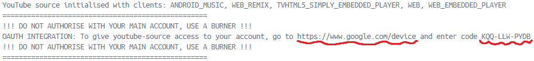
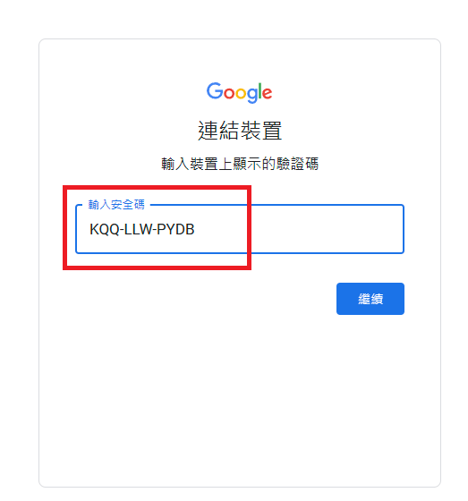
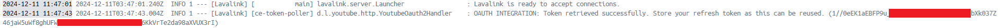
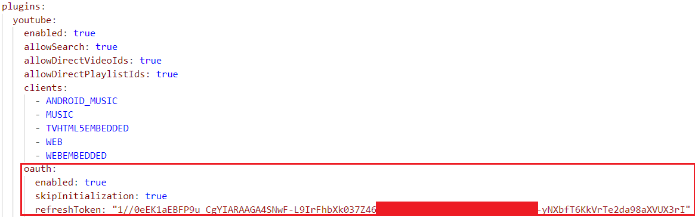

# Hate_Music_Bot_Docker
## 🎵簡單容易使用的DC音樂bot(Docker版本)<br />

本地運行的版本請查看[這裡](https://github.com/Forever-Hate/Hate_Music_Bot)

## 📖開始使用
### 檔案結構
```txt
root(任意資料夾)
 |__docker-compose.yml
 |__application.yml(lavalink的設定檔)
 |__.env
```
1. 填寫 .env
2. 填寫 application.yml
```application.yml
# plugins底下
# 如何取得請查看底下說明
oauth:
  enabled: true
  #skipInitialization: true
  #refreshToken: "your refresh token"

# lavasrc底下
# 請至 https://developer.spotify.com/ 取得
spotify:
  clientId: "your spotify client id"
  clientSecret: "your spotify client secret"
```
3. 至專案根目錄，開啟終端機，啟動docker<br />
```txt
docker compose up -d
```
### 如何取得 oauth 的 refreshToken
1. 啟動容器，並打開 **lavalink的container log**，找到下面圖片的訊息


2. 前往網站 [https://www.google.com/device](https://www.google.com/device)並輸入code


3. 登入帳號，請使用 **分身帳號**

4. 登入完成後，查看** lavalink 的 container log**，請將小括號內的**refreshToken**複製下來


5. 關閉容器並打開 **application.yml**，將剛剛複製的 **refreshToken** 貼上去，並將註解取消


6. 重新啟動容器